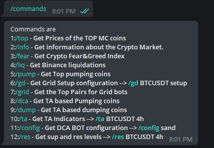
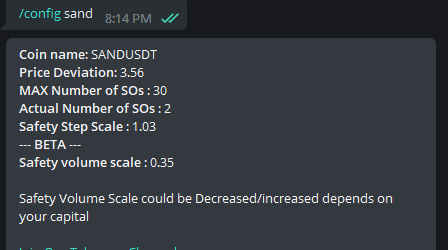
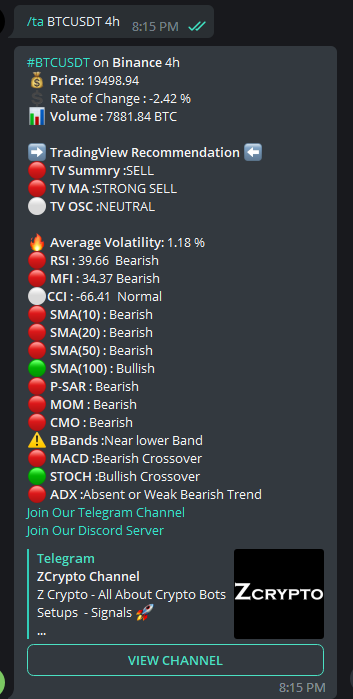
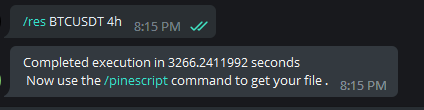
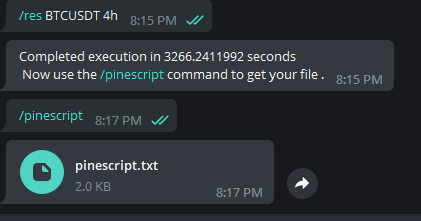

# Crypto-Telegram-BOT
[Crypto Technical Analysis Telegram BOT](https://github.com/TZacksEG/Crypto-Telegram-BOT) 

**RSI , ROC , Volume, MFI, CCI, SMA10 , SMA20, SMA50, SMA100, P-SAR , MOM, BBands , MACD , Stoch , ADX**

Crypto market stats , pump and dump coins , Tradingview pinescript , 3commas and many more

# What does it do ?

**Market General**
* Gets Fear and Greed index 
* Gets Crypto Market stats
* Gets Top Cryptocurrency prices
* Gets Binance liquidations events

**Market Gainers and losers**
* Gets Pumping Coins ( lunarcrush Data )
* Gets TA based Pumping Coins (Real Time Data )
* Gets TA based dumping coins (Real Time Data )
* Gets the Top Pairs for Grid bots 

**Bots Helpers - 3commas & Other Trading Platforms** 

* Gets Grid Setup configuration ( Grid Bots Setup) #3commas or any other Trading platform
* Gets DCA BOT configuration

**Pure Technical Analysis**

* Gets TA Indicators - Coin Technical analysis
* Gets Support and Resistance and fibonacci levels and Creates Tradingview Pinescript for it

**************
# Commands

* /fear 
* /info 
* /top 
* /liq
* /pump
* /dca
* dump
* /grid

https://github.com/TZacksEG/Crypto-Telegram-BOT/blob/main/img.png?raw=true

* /gd --> **usage: (/gd BTCUSDT setup )**

* /config -->  **usage: (/config sand )**

* /ta --> **usage: (/ta BTCUSDT 4h )**

* /res --> **usage: (/res BTCUSDT 4h)**

* /pinescript **Usage : its Created from the above command ( /res ) 

# How to Install ?
`$ git clone https://github.com/TZacksEG/Crypto-Telegram-BOT.git`

`$ cd Crypto-Telegram-BOT`

`$ pip3 install -r requirements.txt`

`add telegram BOT Token in config.py`

`python3 main.py`

if you face issues installing Ta-lib find how to  install here  [Ta-lib installation](https://gist.github.com/quantra-go-algo/1c62f16c7256d9c8d6922916a95e8c5c#file-install_talib-sh)

enjoy

If you have any issues don't hesitate to reach out to me on Telegram https://t.me/TZacks

